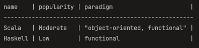
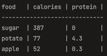

Your favorite functional CSV library: parcsv

parcsv uses `Either[Throwable, CSV]` Monad to enable functional style CSV processing.

Typical flow:
 - Read CSV from different sources (File, Raw String, Map etc..)
 - Choose specific Headers/Rows, apply some filtering etc..
 - Join filtered Rows and Headers to create new CSV
 - Display the processed CSV to validate your intentions
 - Save it

Scala code:

```scala
import com.ghurtchu.csv._

// Read -> Process -> Save

val transformedCSV = for {
  originalCSV <- CSV.fromFile("data/programming_languages.csv")
  headers <- originalCSV.withHeaders("name", "popularity", "paradigm")
  rows <- originalCSV.withRows(3 to 7)
  functionalLangs <- rows.filter(_.value.contains("functional"))
  processedCSV <- headers <+> functionalLangs // join headers and rows to get new CSV
  _  <- processedCSV.display
  _ <- processedCSV.save("data/programming_languages_updated.csv")
} yield processedCSV
```


Print result:



Let's see another example using Raw String as a source

```scala
import com.ghurtchu.csv._

val source =
  """food,calories,protein,carbs,isHealthy
    |apple,52,0.3,14,true
    |egg,155,13,26,true
    |potato,77,4.3,26,true
    |sugar,387,0,100,false
    |""".stripMargin

val transformedCSV = for {
  csv <- CSV.fromString(source)
  cols <- csv.withHeaders("food", "protein", "isHealthy")
  lowProteinFood <- csv.rows.filter { cell =>
    cell.header.value == "protein" && cell.value.toDouble <= 10
  }
  processedCSV <- cols <+> lowProteinFood
  _ <- processedCSV.display
} yield processedCSV
```

Print result:



TODO:
 - slicing
 - add `CSVError` hierarchy to replace `Throwable` in `Either[Throwable, CSV]`
 - and much more...
