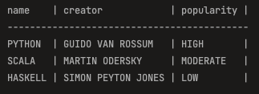

Your favorite functional CSV library: parcsv

parcsv uses `Either[Throwable, CSV]` Monad to enable functional style CSV processing.

Typical flow:
 - Read CSV from different sources (File, Raw String, Map etc..)
 - Process/Transform it
 - Save it

Simple example:

```scala
import com.ghurtchu.csv._

// csv as a raw string
val source =
  """food,calories,protein,carbs,isHealthy
    |apple,52,0.3,14,true
    |egg,155,13,26,true
    |potato,77,4.3,26,true
    |sugar,387,0,100,false
    |""".stripMargin

// let's choose columns filtered by header's value
val containsLetter: Column => Boolean = col => col.header.value.contains("o")

// only keeps those rows which have a value less than 10 under "protein" header
val lowProteinFoodFilter: Row => Boolean = row => {
  row.cells.exists { cell =>
    cell.header.value == "protein" && cell.value.toDouble <= 10
  }
}

// csv processing
val newCSV = for {
  csv  <- CSV.fromString(source)
  csv2 <- csv.keepColumns("food", "protein", "isHealthy")
  csv3 <- csv2.filterRows(lowProteinFoodFilter)
  _    <- csv3.display
} yield csv3
```

Print result:


Let's see an advanced example using `Pipe`-s

`Pipe` holds functions which will be applied sequentially to transform CSV files.
`Pipe` instances may hold filter/map/reduce functions, let's see the usage of:

- `FilterColumnPipe` - filters to columns sequentially
- `FilterRowPipe` - filters to rows sequentially
- `TransformColumnPipe` - transforms rows sequentially

```scala
import com.ghurtchu.csv._

val filterColumnPipe = FilterColumnPipe(
  col => Seq("name", "popularity", "creator").contains(col.header.value), // choose columns by names
  col => col.cells.forall(_.value.length <= 20) // keep columns with all values shorter than 20 characters
)

val filterRowPipe = FilterRowPipe(
  row => row.index % 2 == 1, // then take only odd-indexed rows
  row => row.isFull // then keep those which have no N/A-s
)

val transformColumnPipe = TransformColumnPipe(
  col => Column(col.header, col.cells.map(cell => cell.copy(value = cell.value.toUpperCase))) // make all values uppercase
)

// application order will be preserved from left to right
val fullPipe = filterColumnPipe ~> filterRowPipe ~> transformColumnPipe

val transformedCSV = for {
  csv         <- CSV.fromFile("data/programming_languages.csv")
  transformed <- csv.transformVia(fullPipe)
  _           <- transformed.display
  _           <- transformed.save("data/updated.csv")
} yield transformed

```

Print result:




TODO:
 - slicing
 - add `CSVError` hierarchy to replace `Throwable` in `Either[Throwable, CSV]`
 - and much more...
